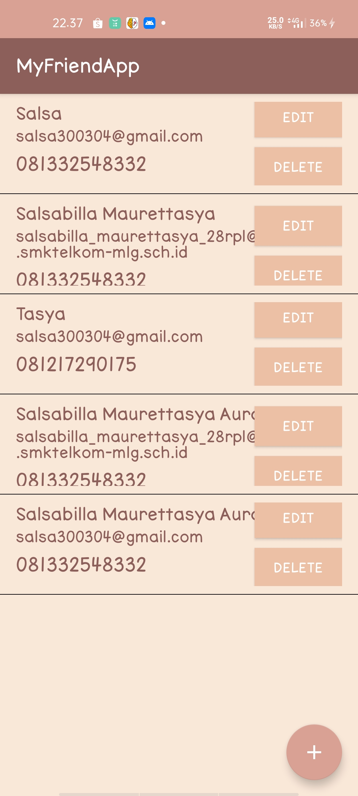
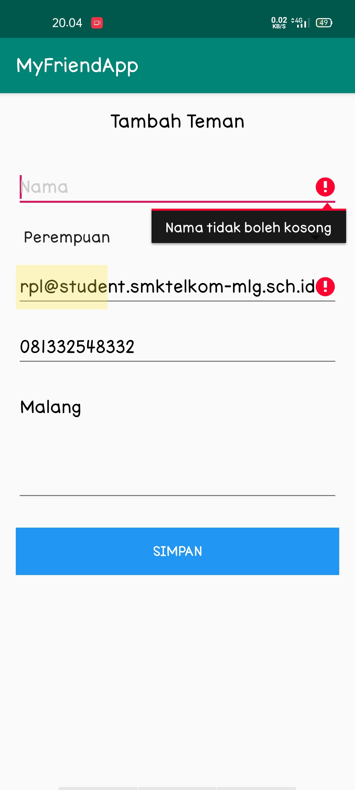
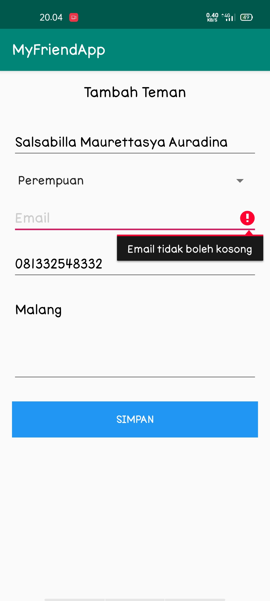
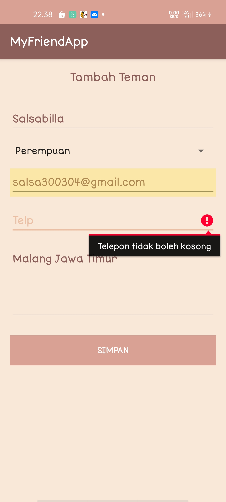
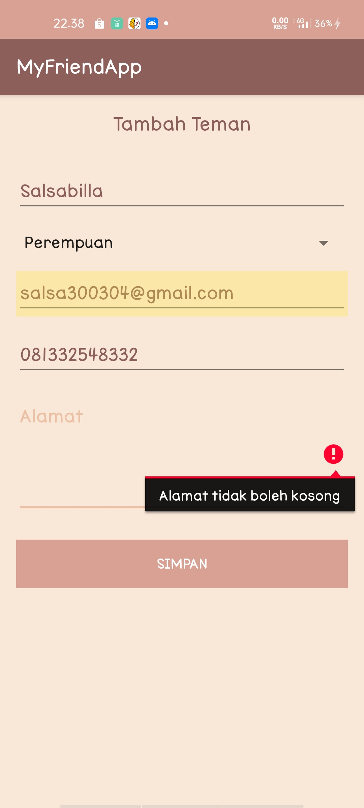
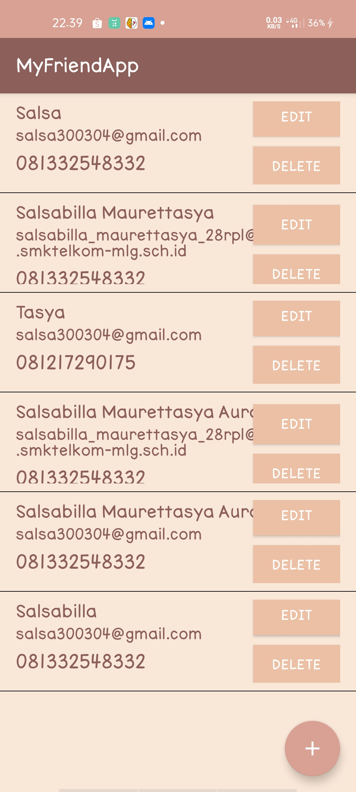

# MyFriendApp

Hasil dari MyFriendApp :

> ### Mengisi Data :

Data Tidak bisa disubmit saat salahsatunya kosong seperti berikut :

Setelah disubmit maka hasilnya muncul di list seperti berikut ini :

