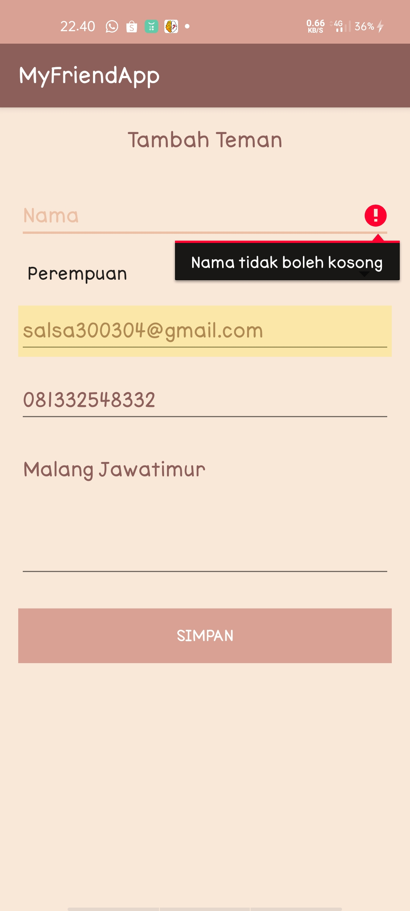
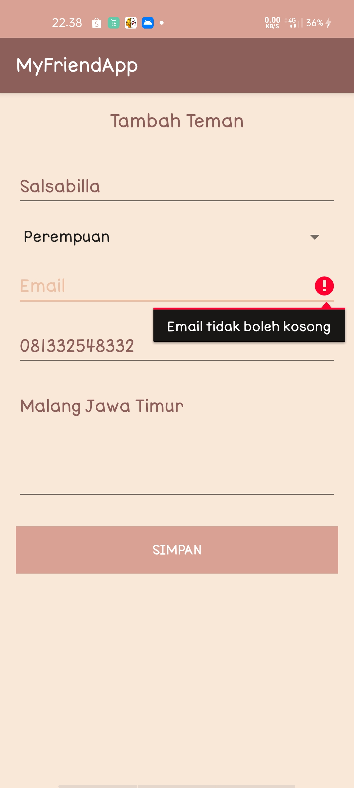

# MyFriendApp

Pada aplikasi ini menerapkan : 

> ### Fragment
[Fragment](https://developer.android.com/guide/components/fragments?hl=id) mewakili perilaku atau bagian dari antarmuka pengguna dalam FragmentActivity. Anda bisa mengombinasikan beberapa fragmen dalam satu aktivitas untuk membangun UI multipanel dan menggunakan kembali sebuah fragmen dalam beberapa aktivitas. Anda bisa menganggap fragmen sebagai bagian modular dari aktivitas, yang memiliki daur hidup sendiri, menerima kejadian masukan sendiri, dan yang bisa Anda tambahkan atau hapus saat aktivitas berjalan (semacam "subaktivitas" yang bisa digunakan kembali dalam aktivitas berbeda).

> ### Room Database
[Room database](https://developer.android.com/training/data-storage/room?hl=id) memberikan lapisan abstraksi pada SQLite untuk memungkinkan akses database yang lancar sekaligus memanfaatkan kemampuan SQLite secara optimal.

Hasil dari MyFriendApp :

> ### Mengisi Data :

Mengisi data dilakukan dengan cara menekan button + yang berada pada pojok kanan bawah maka akan muncul form pengisian data

Data Tidak bisa disubmit saat salahsatunya kosong seperti berikut :

Setelah disubmit maka hasilnya muncul di list seperti berikut ini :

Terimakasih:))

# Salsabilla Maurettasya A

# 39 / XI RPL 3

